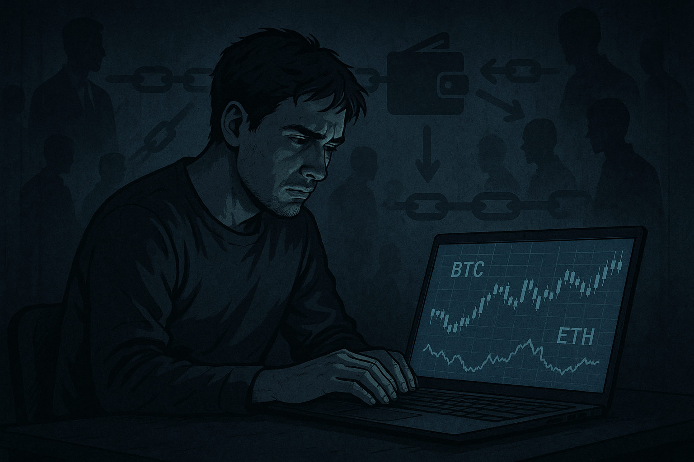
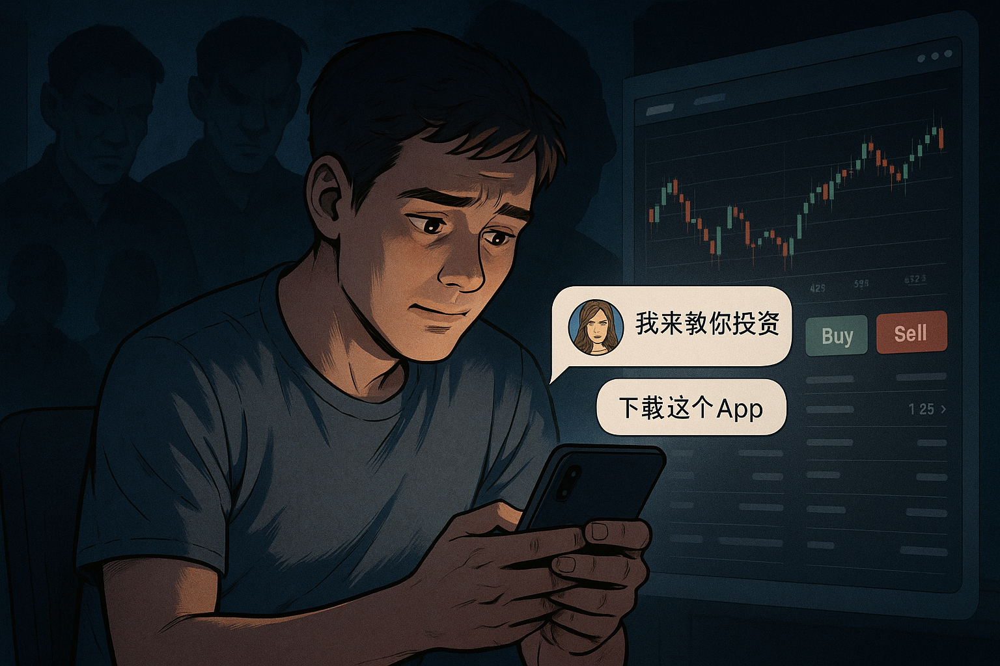
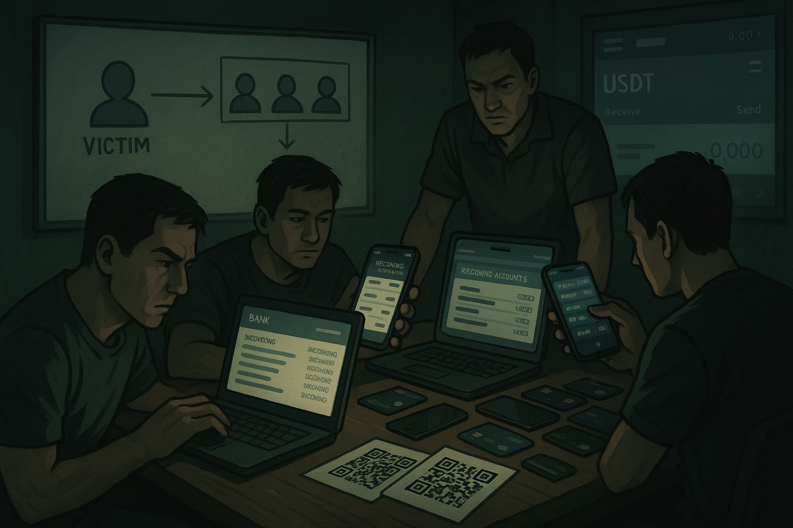
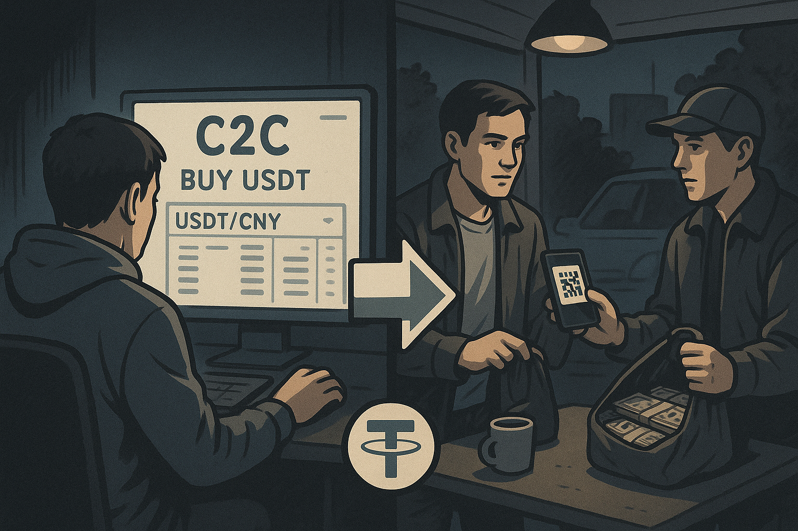
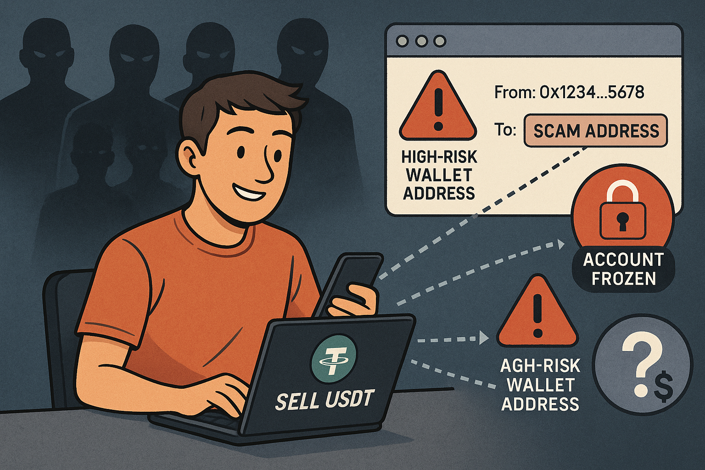
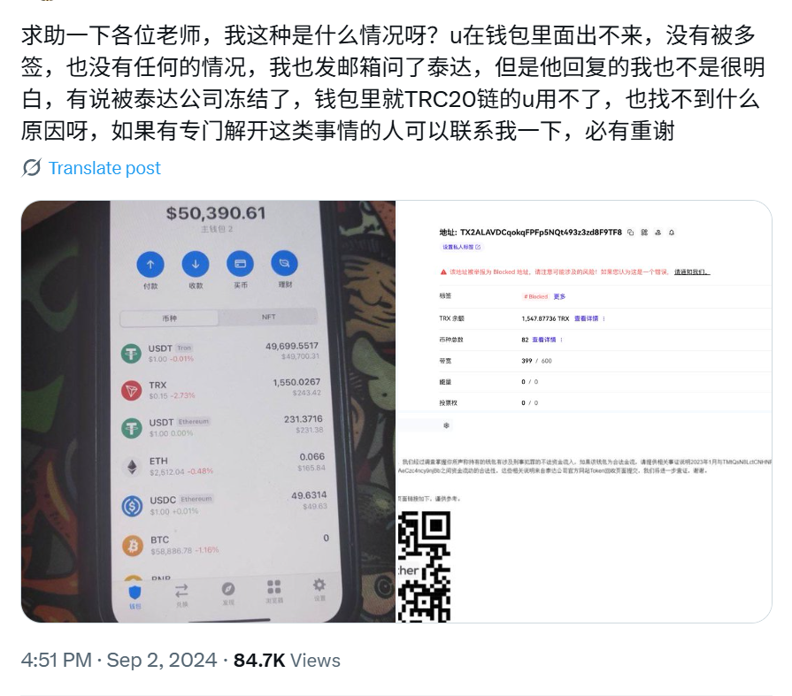
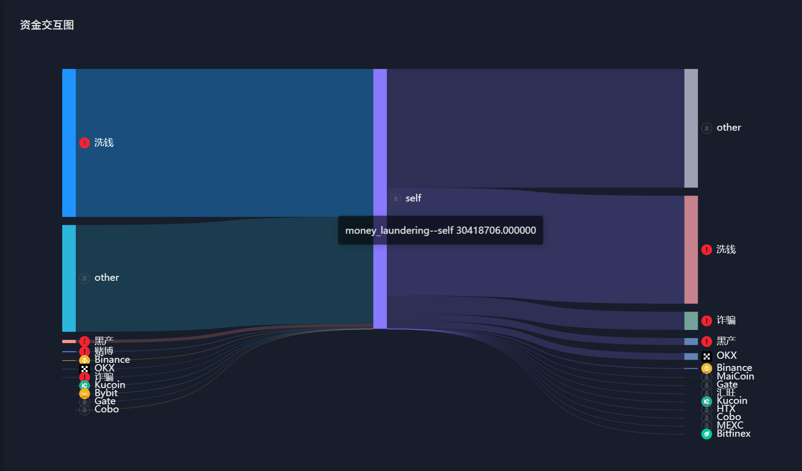
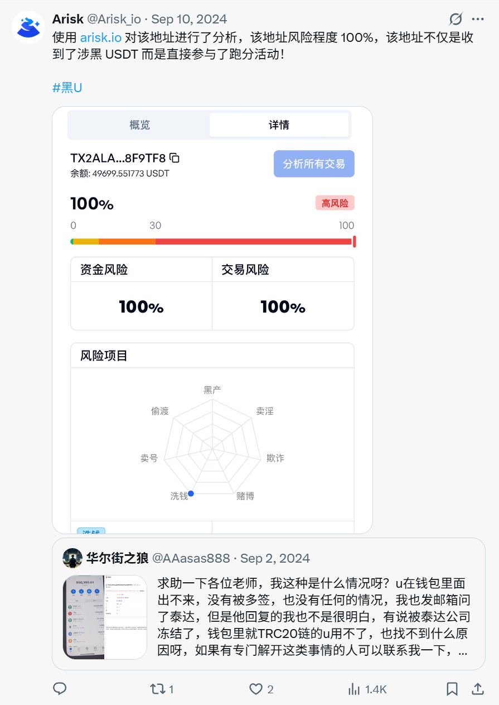

# 当“投资”变成帮凶：虚拟币玩家如何被卷入东南亚黑灰产洗钱链

## 背景

过去几年，虚拟币因其**去中心化、全球流通**等特性，逐渐成为资本新宠。尤其是在亚洲地区，以 **USDT（泰达币）** 为代表的稳定币成为交易、支付乃至“避险”的重要工具。

然而，正是这种**便捷、自由、监管缺失**的特性，让加密货币也成为黑灰产集团洗钱的理想渠道。

## 东南亚地下经济中的“主干道”

自 2021 年以来，**东南亚地区的跨境诈骗、博彩洗钱、杀猪盘等犯罪活动快速蔓延**。这些团伙逐渐形成了成熟的地下金融网络，而虚拟币，则成为他们资金流转的“主干道”。

据联合国毒品与犯罪办公室（UNODC）报告：

> 虚拟货币已成为亚洲地下经济中“不可或缺”的洗钱工具。

## 被利用的普通用户

由于虚拟币交易通常不涉及实名验证，这些“被利用”的投资者**极难自证清白**。一旦被监管系统或司法机关盯上，可能面临以下风险：

- **资产冻结**
- **调查传唤**
- **刑事责任**

本文旨在揭示：

> 普通虚拟币用户，是如何一步步被东南亚黑灰产集团悄然卷入洗钱网络的。

并帮助读者：

- 了解背后的运作机制  
- 识别潜在风险信号  
- 避免在无知中成为洗钱链上的一环

## 典型洗钱流程详解：一场跨越链上链下的协同作案

黑灰产洗钱并非传统印象中的“复杂金融操作”，而是一整套**高度流程化、任务模块化**的产业链。

它将**受害者、收款车队、币商、中间人、诈骗团伙**等角色嵌入一个高效的“资金清洗链路”中。

以下以典型的“杀猪盘”诈骗为例，**还原整个链条的关键步骤**。

---

### 1. 骗局启动：诈骗团伙锁定目标

诈骗集团通过社交平台伪装成 “美女”、“帅哥”、“投资导师” 等身份，获取受害者信任后，诱导其下载**虚假的投资 App 或博彩平台**，并不断鼓励其充值转账。

**特点：**

- 虚假平台高度仿真，界面专业  
- 前期可提现，营造盈利假象  
- 后期大额提现时出现“补税”或“冻结审查”，进一步诱骗资金  

### 2. 收款环节：车队接管资金入口

诈骗团伙并不会直接接收资金，而是联系所谓的“车队”，使用其控制的人头账户、银行卡或第三方支付二维码，作为资金接收通道。

**“车队”的作用：**

- 提供大量收款账户接收被骗资金  
- 操作手能快速将被骗资金分散并取现  
- 通过 USDT 向诈骗团伙结算  

### 3. 汇兑转换：车队将法币兑换为 USDT

车队收到被骗资金后，会迅速将人民币兑换为虚拟币（常为 USDT），操作方式包括：

- 在交易所 C2C 市场上购买 USDT  
- 联系线下币商以现金方式换取 USDT  

### 4. 虚拟币投资者“被动洗钱”

普通虚拟币投资者并不知道，自己在线上或线下出售 USDT、兑换法币的过程中，**可能正在接收来自诈骗团伙的钱款**，或将资金转入涉诈钱包地址。

虽然主观上并无恶意，但这些行为恰恰构成了整条洗钱路径中的**“关键一环”**，令他们在链上路径和资金流向中，成为洗钱链条的“落脚点”。

**常见场景：**

- 在交易所出售 USDT，收到黑钱  
- 线下出售 USDT 收现金，USDT 流入高风险钱包  

**风险在于：**

- 一旦上游涉案，链上溯源将指向无辜投资者  
- 用户账户可能被冻结、资产被追查  
- 法律责任认定模糊，难以自证“清白”  

## 并非所有“受害者”都是无辜：一个真实钱包冻结案例

尽管许多普通投资者确实因“不知情”卷入链上洗钱路径，  
但**并非所有自称“被动参与”的人都是无辜**。

有时，那些在社交平台上发声求助的“受害者”，  
其实正是黑产资金流转中的关键一环。

以下这个真实案例，即通过我们内部系统 **“渔夫”**，揭示了一个被 Tether（泰达）冻结的钱包地址背后的真相。

### 案例背景

2024 年 9 月，一位 Twitter 用户发布求助帖，称其**个人钱包地址被 Tether 官方冻结**，导致全部 USDT 无法流转，且“**不明原因**”。

### 链上交互与行为识别：揭示地址背后的真实用途

我们通过 **Arisk.io** 对该地址进行了风险画像分析。

初步结果显示：

- 该地址与多个**高风险标签地址**频繁发生链上交互  
- **超过 60% 的资金流向或流入**，均涉及已知诈骗团伙相关地址

 

### “渔夫系统”识别结果：诱导中的主动配合

为进一步验证该地址的实际行为，我们使用内部 “渔夫系统” 进行了深度查询。查询结果发现渔夫系统在该用户冻结前，通过模拟不同身份角色（如 C2C 交易卖家、中介卡商等），与该地址所有人展开了多轮诱导，该地址所有人两次主动提供收款地址！

从行为上看，该地址**并非不知情的被动参与者**，而是具备一定的协作意图，构成黑灰产资金流转链条中的重要节点。

在该用户于 Twitter 发出求助帖后，我们对其地址行为进行分析并确认存在严重问题后，  **直接在评论区进行了回应**，指出：

> 该地址与多起链上洗钱路径直接相关，资金已多次流入高风险诈骗团伙钱包。  
> 该地址直接参与了洗钱行为。

 

 ## 普通投资者如何规避“被动洗钱”风险

**“无知”并不等于“免责”**。为避免卷入洗钱路径，普通用户应采取以下措施：

### 1. 核查对方地址风险

在交易前使用 [Arisk.io](https://arisk.io) 等工具对对方钱包进行风险画像分析，识别是否与涉诈、涉黑、等地址有交互历史。

### 2. 优先使用合规交易所

尽量通过 **实名制、风控完善的中心化平台**进行交易，避免通过 Telegram、QQ群、微信群等渠道进行私下 OTC 买卖。

### 3. 警惕“高收益搬砖”陷阱

一些大型跑分车队正向**“平台化”**发展，搭建“搬砖套利”系统。  
他们通过**高于正常交易所价格**吸引用户参与搬砖，实则掩盖洗钱路径。

### 4. 线下交易务必保留记录

如需线下卖币收现金，务必：

- 明确对方身份（如身份证、手机号）
- 拍照保留转账记录、聊天截图  
- 确保转账资金来源清晰，**防止流向涉诈地址**  

---
